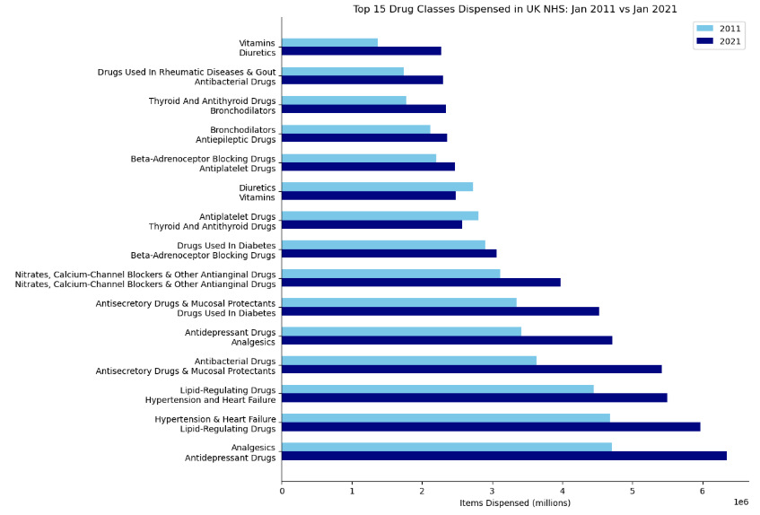

# NHS-prescribing-trends

### Note:
You can see the detailed data loading/cleaning and data visualization code by directly clicking on nhs_prescribing_trends.ipynb file.

### <u>Research Question</u>
This personal project aimed to answer the following question:

<b>How did the distribution of the top 15 most dispensed drug groups in the National Health Service (NHS) in the United Kingdom change between January 2011 and January 2021?</b>

### <u>Findings</u>

The plot reveals notable shifts in prescribing patterns across the decade. In 2011, analgesics (ie, painkillers) were the most dispensed drug class, whereas by 2021, antidepressants were at the top position. More essential drugs - such as cholesterol-lowering drugs and blood pressure lowering-drugs - remained consistently highly prescribed, reflecting their importance in chronic disease management. Conversely, antibiotics saw a reduction in dispensing volume, potentially reflecting increased awareness of antibiotic resistance and antibiotic stewardship. These results show interesting insights into the changing landscape of patient care.

### <u>Links</u>
The link to the NHS Prescription Cost Analysis (PCA) dataset can be found here:

https://www.nhsbsa.nhs.uk/prescription-data/dispensing-data/prescription-cost-analysis-pca-data
